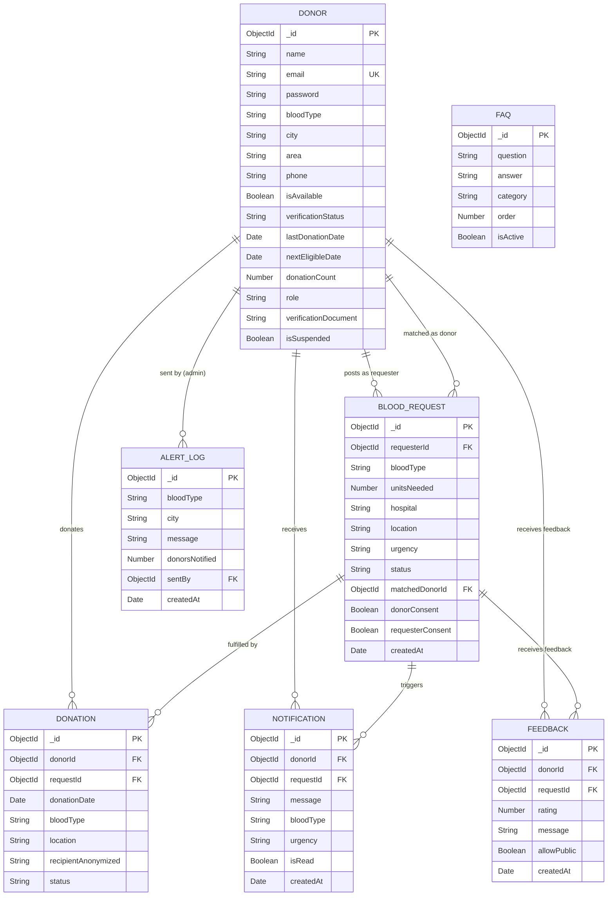
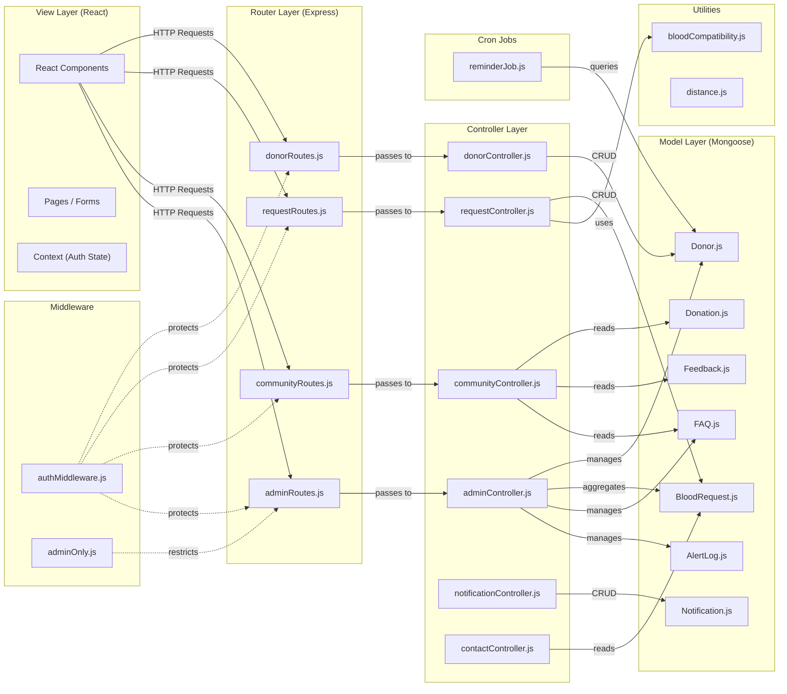

# Blood Donation & Emergency Request Platform — Class Diagram

## CSE470 — Group 6

---

## Full System Class Diagram

```mermaid
classDiagram
    direction TB

    %% ===== MODELS =====
    class Donor {
        +ObjectId _id
        +String name
        +String email
        +String password
        +String bloodType
        +String city
        +String area
        +String phone
        +Object medicalFlags
        +Boolean isAvailable
        +Boolean isVerified
        +String verificationStatus
        +Date lastDonationDate
        +Date nextEligibleDate
        +Number donationCount
        +String[] badges
        +String role
        +Object coordinates
        +String verificationDocument
        +Boolean isSuspended
        +Date createdAt
    }

    class BloodRequest {
        +ObjectId _id
        +ObjectId requesterId
        +String bloodType
        +Number unitsNeeded
        +String hospital
        +String location
        +String urgency
        +String status
        +Object[] statusHistory
        +ObjectId matchedDonorId
        +Boolean donorConsent
        +Boolean requesterConsent
        +Date createdAt
    }

    class Donation {
        +ObjectId _id
        +ObjectId donorId
        +ObjectId requestId
        +Date donationDate
        +String bloodType
        +String location
        +String recipientAnonymized
        +String status
    }

    class Notification {
        +ObjectId _id
        +ObjectId donorId
        +ObjectId requestId
        +String message
        +String bloodType
        +String hospital
        +String urgency
        +Boolean isRead
        +Date createdAt
    }

    class Feedback {
        +ObjectId _id
        +ObjectId donorId
        +ObjectId requestId
        +Number rating
        +String message
        +Boolean allowPublic
        +Date createdAt
    }

    class FAQ {
        +ObjectId _id
        +String question
        +String answer
        +String category
        +Number order
        +Boolean isActive
    }

    class AlertLog {
        +ObjectId _id
        +String bloodType
        +String city
        +String message
        +Number donorsNotified
        +ObjectId sentBy
        +Date createdAt
    }

    %% ===== CONTROLLERS =====
    class DonorController {
        +registerDonor(req, res)
        +loginDonor(req, res)
        +getDonorProfile(req, res)
        +updateDonorProfile(req, res)
        +toggleAvailability(req, res)
        +applyForVerification(req, res)
        +searchDonors(req, res)
    }

    class RequestController {
        +createRequest(req, res)
        +getRequest(req, res)
        +getRequests(req, res)
        +getMyRequests(req, res)
        +getCompatibleDonors(req, res)
        +respondToRequest(req, res)
        +requesterConsent(req, res)
        +updateStatus(req, res)
        +getContactInfo(req, res)
    }

    class CommunityController {
        +getDonationHistory(req, res)
        +getDonorStats(req, res)
        +getRequesterHistory(req, res)
        +getLeaderboard(req, res)
        +submitFeedback(req, res)
        +getDonorFeedback(req, res)
        +getFAQs(req, res)
    }

    class AdminController {
        +getAllUsers(req, res)
        +suspendUser(req, res)
        +approveVerification(req, res)
        +getBloodInventory(req, res)
        +getRequestAnalytics(req, res)
        +getDonationAnalytics(req, res)
        +getMatchRate(req, res)
        +getResponseTime(req, res)
        +sendBroadcast(req, res)
        +getBroadcastHistory(req, res)
        +createFAQ(req, res)
        +updateFAQ(req, res)
        +deleteFAQ(req, res)
    }

    class NotificationController {
        +getNotifications(req, res)
        +getUnreadCount(req, res)
        +markAsRead(req, res)
        +markAllAsRead(req, res)
    }

    %% ContactController removed — getContactInfo is now in RequestController

    %% ===== UTILITIES =====
    class BloodCompatibility {
        +Object compatibilityMap
        +getCompatibleDonorTypes(bloodType) String[]
        +getCompatibilityScore(donor, needed) Number
        +getMatchDetails(donor, needed) Object
        +findEligibleDonors(bloodType, city) Donor[]
    }

    class HaversineDistance {
        +haversineDistance(lat1, lon1, lat2, lon2) Number
    }

    %% ===== MIDDLEWARE =====
    class AuthMiddleware {
        +protect(req, res, next)
    }

    class AdminOnly {
        +adminOnly(req, res, next)
    }

    %% ===== CRON JOBS =====
    class ReminderJob {
        +runDailyCheck()
        +sendReminderEmail(email, name, date)
    }

    %% ===== RELATIONSHIPS =====

    %% Controller → Model (uses)
    DonorController --> Donor : creates/reads/updates
    RequestController --> BloodRequest : creates/reads/updates
    RequestController --> Donor : queries eligible donors
    CommunityController --> Donation : reads/aggregates
    CommunityController --> BloodRequest : reads history
    CommunityController --> Feedback : creates/reads
    CommunityController --> FAQ : reads
    AdminController --> Donor : reads/updates
    AdminController --> BloodRequest : aggregates
    AdminController --> Donation : aggregates
    AdminController --> FAQ : creates/updates/deletes
    AdminController --> AlertLog : creates/reads
    NotificationController --> Notification : creates/reads/updates
    ContactController --> BloodRequest : checks consent

    %% Model → Model (references)
    BloodRequest --> Donor : requesterId references
    BloodRequest --> Donor : matchedDonorId references
    Donation --> Donor : donorId references
    Donation --> BloodRequest : requestId references
    Notification --> Donor : donorId references
    Notification --> BloodRequest : requestId references
    Feedback --> Donor : donorId references
    Feedback --> BloodRequest : requestId references
    AlertLog --> Donor : sentBy references

    %% Controller → Utility (uses)
    RequestController --> BloodCompatibility : uses for matching
    AdminController --> BloodCompatibility : uses for broadcast
    ReminderJob --> Donor : queries eligible donors

    %% Middleware → Controller (protects)
    AuthMiddleware --> DonorController : protects routes
    AuthMiddleware --> RequestController : protects routes
    AuthMiddleware --> CommunityController : protects routes
    AuthMiddleware --> AdminController : protects routes
    AdminOnly --> AdminController : restricts to admin role
```

---

## Model Relationships Diagram

```mermaid
erDiagram
    DONOR ||--o{ BLOOD_REQUEST : "posts as requester"
    DONOR ||--o{ BLOOD_REQUEST : "matched as donor"
    DONOR ||--o{ DONATION : "donates"
    DONOR ||--o{ NOTIFICATION : "receives"
    DONOR ||--o{ FEEDBACK : "receives feedback"
    DONOR ||--o{ ALERT_LOG : "sent by (admin)"

    BLOOD_REQUEST ||--o{ DONATION : "fulfilled by"
    BLOOD_REQUEST ||--o{ NOTIFICATION : "triggers"
    BLOOD_REQUEST ||--o{ FEEDBACK : "receives feedback"

    DONOR {
        ObjectId _id PK
        String name
        String email UK
        String password
        String bloodType
        String city
        String area
        String phone
        Boolean isAvailable
        String verificationStatus
        Date lastDonationDate
        Date nextEligibleDate
        Number donationCount
        String role
        String verificationDocument
        Boolean isSuspended
    }

    BLOOD_REQUEST {
        ObjectId _id PK
        ObjectId requesterId FK
        String bloodType
        Number unitsNeeded
        String hospital
        String location
        String urgency
        String status
        ObjectId matchedDonorId FK
        Boolean donorConsent
        Boolean requesterConsent
        Date createdAt
    }

    DONATION {
        ObjectId _id PK
        ObjectId donorId FK
        ObjectId requestId FK
        Date donationDate
        String bloodType
        String location
        String recipientAnonymized
        String status
    }

    NOTIFICATION {
        ObjectId _id PK
        ObjectId donorId FK
        ObjectId requestId FK
        String message
        String bloodType
        String urgency
        Boolean isRead
        Date createdAt
    }

    FEEDBACK {
        ObjectId _id PK
        ObjectId donorId FK
        ObjectId requestId FK
        Number rating
        String message
        Boolean allowPublic
        Date createdAt
    }

    FAQ {
        ObjectId _id PK
        String question
        String answer
        String category
        Number order
        Boolean isActive
    }

    ALERT_LOG {
        ObjectId _id PK
        String bloodType
        String city
        String message
        Number donorsNotified
        ObjectId sentBy FK
        Date createdAt
    }
```

---

## MVC Architecture Flow

```mermaid
flowchart LR
    subgraph VIEW["View Layer (React)"]
        A["React Components"]
        B["Pages / Forms"]
        C["Context (Auth State)"]
    end

    subgraph ROUTER["Router Layer (Express)"]
        D["donorRoutes.js"]
        E["requestRoutes.js"]
        F["communityRoutes.js"]
        G["adminRoutes.js"]
    end

    subgraph CONTROLLER["Controller Layer"]
        H["donorController.js"]
        I["requestController.js"]
        J["communityController.js"]
        K["adminController.js"]
        L["notificationController.js"]
        M["contactController.js"]
    end

    subgraph MODEL["Model Layer (Mongoose)"]
        N["Donor.js"]
        O["BloodRequest.js"]
        P["Donation.js"]
        Q["Notification.js"]
        R["Feedback.js"]
        S["FAQ.js"]
        T["AlertLog.js"]
    end

    subgraph MIDDLEWARE["Middleware"]
        U["authMiddleware.js"]
        V["adminOnly.js"]
    end

    subgraph UTILS["Utilities"]
        W["bloodCompatibility.js"]
        X["distance.js"]
    end

    subgraph JOBS["Cron Jobs"]
        Y["reminderJob.js"]
    end

    A -->|HTTP Requests| D
    A -->|HTTP Requests| E
    A -->|HTTP Requests| F
    A -->|HTTP Requests| G

    D -->|passes to| H
    E -->|passes to| I
    F -->|passes to| J
    G -->|passes to| K

    U -.->|protects| D
    U -.->|protects| E
    U -.->|protects| F
    U -.->|protects| G
    V -.->|restricts| G

    H -->|CRUD| N
    I -->|CRUD| O
    I -->|uses| W
    J -->|reads| P
    J -->|reads| R
    J -->|reads| S
    K -->|manages| N
    K -->|aggregates| O
    K -->|manages| S
    K -->|manages| T
    L -->|CRUD| Q
    M -->|reads| O

    Y -->|queries| N
```
